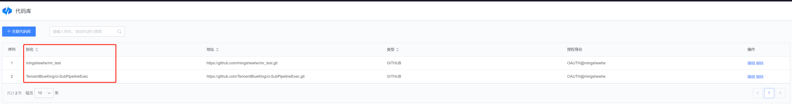
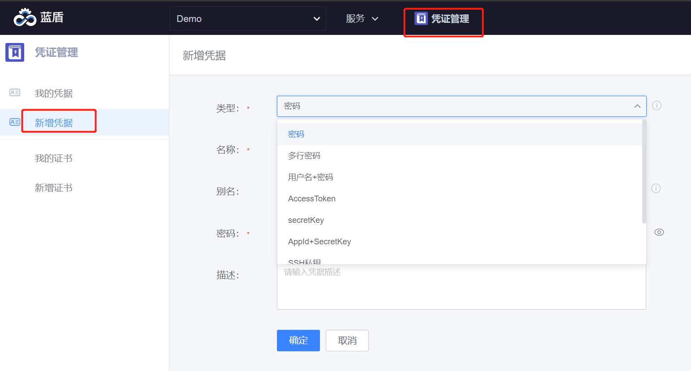

checkout插件为蓝盾平台提供基本的git拉取操作，可以拉取所有的git仓库
## 插件功能
- 支持根据导入蓝盾的代码库ID/别名拉取代码
- 支持根据git仓库url拉取代码
- 支持拉取指定的分支/tag/commit
- 支持拉取文件到指定的路径
- 支持拉取submodule
- 支持拉取lfs文件
- 支持浅克隆和部分克隆
- 支持pre-merge: 当pr/mr事件触发时,会在构建机上将源分支和目标分支进行merge

## 使用说明
### 入参
#### 代码库
- 按代码库选择: 从蓝盾代码库列表中选择git类型的仓库
- 按代码库别名输入: 蓝盾代码库别名,支持变量,蓝盾代码库必须先创建
  
- 按仓库URL输入: 填写git仓库url,如https://github.com/TencentBlueKing/ci-git-checkout.git

#### 授权类型
授权类型只有在[代码库]入参选择'按仓库URL输入'才需要填写
- 空: 拉取的仓库不需要凭证,如拉取github开源仓库
- 凭证: 需选择[代码库凭证],需要先在[凭证管理]页面创建凭证
  
    1. 如果git url为http/https类型,则可以创建[用户名+密码]、[用户名密码+私有token]、[AccessToken]类型
    2. 如果git url为ssh/git类型,则创建[SSH私钥]、[SSH私钥+私有token]类型
- access token: [access token]输入框需填写access token的值
    1. github的access token可以在https://github.com/settings/tokens 页面创建
    2. gitlab的可以在https://gitlab.com/-/profile/personal_access_tokens 页面创建,私有的gitlab在对应的服务页面申请 
- username/password: [username]和[password]输入框输入用户名密码,不建议此方式,如果是用户名密码，建议保存到凭证管理中,然后使用凭证引用

#### 指定拉取方式
- BRANCH: 按照分支拉取,[分支/TAG/COMMIT]输入框填写要拉取的分支
- TAG: 按照tag拉取,[分支/TAG/COMMIT]输入框填写要拉取的tag
- COMMIT_ID: 按照commitId拉取,[分支/TAG/COMMIT]输入框填写要拉取的commitId

#### 代码保存路径
将代码拉取到指定的路径
注意:
1. 只能拉取到工作空间下,如果填写的是绝对路径,也是拉取到工作空间下，如工作空间是/data/landun/workspace,填写的是/tmp,那么最终会拉取到/data/landun/workspace/tmp目录下
2. 如果同job拉取多个代码库时，可以通过此项配置避免代码覆盖
#### 拉取策略
- Revert Update: 增量,每次先"git reset --hard HEAD",再"git pull"
- Fresh Checkout: 全量,每次都会全新clone代码,之前会delete整个工作空间
- Increment Update: 增量,只使用"git pull",并不清除冲突及历史缓存文件
### 出参
插件运行成功后，会输出本次拉取的代码库信息，可以在后续插件中通过上下文${{jobs.xxx.steps.xxx.变量名}}引用

| 变量名 | 描述                                                                                                             |
| --- |----------------------------------------------------------------------------------------------------------------|
| BK_CI_GIT_REPO_URL | 代码库url                                                                                                         |
| BK_CI_GIT_REPO_ALIAS_NAME | 代码库别名                                                                                                          |
| BK_CI_GIT_REPO_NAME | 代码库项目名,如代码库url是<br/>https://github.com/TencentBlueKing/ci-git-checkout.git，那么值为TencentBlueKing/ci-git-checkout |
| BK_CI_GIT_REPO_REF | 分支/TAG/COMMIT 的值                                                                                               |
| BK_CI_GIT_REPO_CODE_PATH | 代码保存路径的值                                                                                                       | 
| BK_CI_GIT_REPO_LAST_COMMIT_ID        | 拉取代码时，上次构建最后的commit id                                                                                         |
| BK_CI_GIT_REPO_HEAD_COMMIT_ID        | 拉取代码时，本次构建最后的commit id,构建机上最新的commitId                                                                         |
| BK_CI_GIT_REPO_HEAD_COMMIT_COMMENT   | 拉取代码时，本次构建最后的commit注释                                                                                          |
| BK_CI_GIT_REPO_HEAD_COMMIT_AUTHOR    | 本次产生的新的author                                                                                                  |
| BK_CI_GIT_REPO_HEAD_COMMIT_COMMITTER | 本次产生的新的committer                                                                                               |
| BK_CI_GIT_REPO_MR_TARGET_HEAD_COMMIT_ID | pre merge时，目标分支最新的commitId|
| BK_CI_GIT_REPO_MR_SOURCE_HEAD_COMMIT_ID | pre merge时,源分支最新的commitId |

## 场景
checkout插件可以跟gitlab事件触发、github事件触发、tgit事件触发配合使用,配合的前提时触发的代码库与拉取的代码库url相同
1. push触发，拉取触发的分支
   [分支/TAG/COMMIT]输入框的值填写${{BK_CI_REPO_GIT_WEBHOOK_BRANCH}}
2. mr触发,开启perMerge
  插件开启pre-merge,默认是开启的,会自动将源分支合并到目标分支
3. mr触发,仅拉取源分支
  插件关闭per-merge功能,[分支/TAG/COMMIT]输入框的值填写${{BK_CI_REPO_GIT_WEBHOOK_SOURCE_BRANCH}}

## 使用限制和受限解决方案
1. 构建机或镜像中必须已经安装git

## 常见的失败原因和解决方案
1. 使用ssh方式拉代码，出现Host key verification failed. fatal: Could not read from remote repository.错误，如果检查公私钥正确的情况下，在构建机中~/.ssh/config增加
```shell
# xxx是拉取的代码库域名
Host xxx
  StrictHostKeyChecking no
```
如果是在镜像中,镜像又不方便修改，可以在插件之前，增加bash插件，输入
```shell
mkdir ~/.ssh
# xxx要替换成拉取的代码库域名
echo -e "Host xxx\nStrictHostKeyChecking no\n" > ~/.ssh/config
```
2. git常见FAQ参考
   [Git插件常见报错及解决办法](https://github.com/TencentBlueKing/ci-git-checkout/wiki/Git%E6%8F%92%E4%BB%B6%E5%B8%B8%E8%A7%81%E6%8A%A5%E9%94%99%E5%8F%8A%E8%A7%A3%E5%86%B3%E5%8A%9E%E6%B3%95)

## 安装
[上架checkout插件](./install.md)

## 协同
