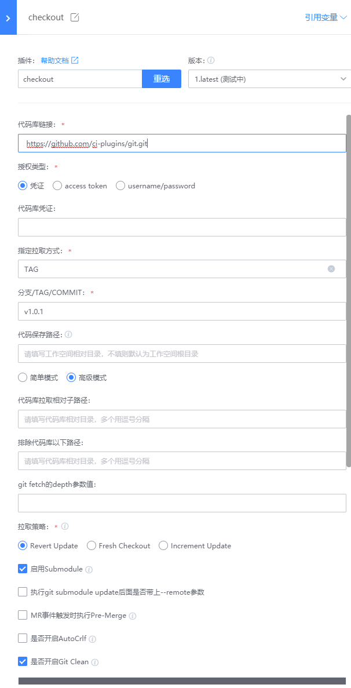

# 通用git插件

根据代码库url拉取代码，适用于所有的git仓库

## 使用指南

### 一、新增插件

在蓝盾的研发商店->工作台->新增插件 页面，


各字段值填写如下:

名称: checkout（这个可以自定义)

标识: git

调试项目: 选择自己的项目

开发语言: java

自定义前端: 否

### 二、配置插件

当插件上架后，就可以在流水线中选择插件，插件配置如下:



- 代码库链接: 要拉取代码库的url
- 指定拉取方式：BRANCH/TAG/COMMIT
- 分支/TAG/COMMIT：要拉取的分支/TAG/commit
- 代码库保存路径：相对于工作空间的保存路径，比如填写code，那么拉取的代码将放在${workspace}/code目录下
- 拉取策略：
  - Revert Update: 增量,每次先"git reset --hard HEAD",再"git pull"  
  - Fresh Checkout: 全量,每次都会全新clone代码,之前会delete整个工作空间  
  - Increment Update: 增量,只使用"git pull",并不清除冲突及历史缓存文件  
- 启用submodule: 开启子模块的拉取
- MR事件触发时执行Pre-Merge: 如果是MR/PR事件触发，则会将源分支与目标分支在工作空间进行合并。
- 是否开启git clean：开启会执行git clean -xdf命令

## 协同

### 一、环境

- gradle：4.8 ~ 4.10

### 二、打包

gradle clean buildZip

### 三、代码解析

1. GitCodeAtom：代码入口
2. GitUpdateTask：执行git命令

## 四、FAQ
1. 使用ssh方式拉代码，出现Host key verification failed. fatal: Could not read from remote repository.错误，如果检查公私钥正确的情况下，在构建机中~/.ssh/config增加
```shell
# hostName是拉取的代码库域名
Host hostName
  StrictHostKeyChecking no
```
