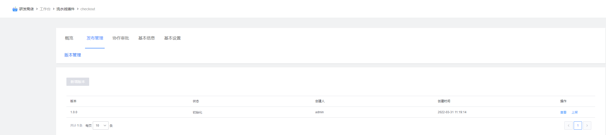
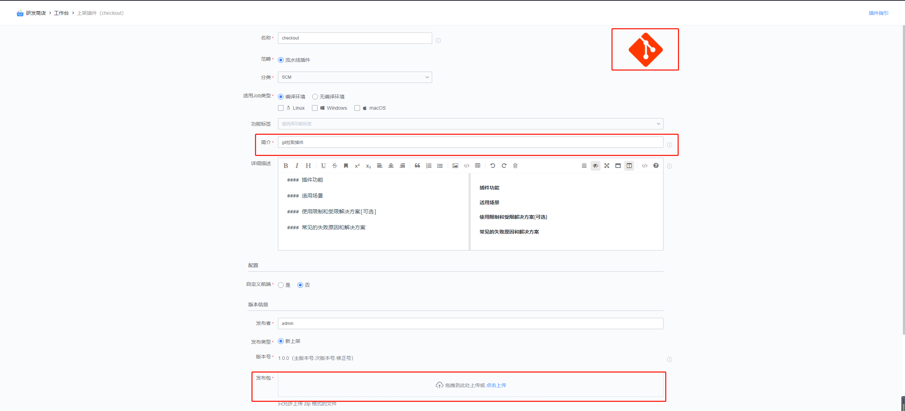
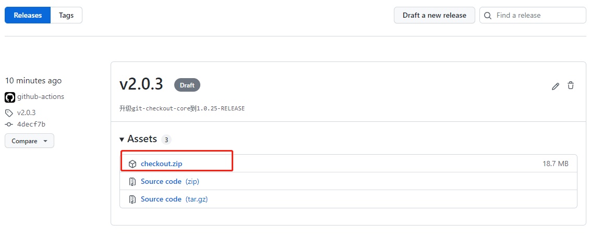

# checkout插件

根据代码库url拉取代码，适用于所有的git仓库

## 使用指南

### 一、新增插件

在蓝盾的研发商店->工作台->新增插件 页面，


各字段值填写如下:

名称: checkout（这个可以自定义)

标识: checkout

调试项目: 选择自己的项目

开发语言: java

自定义前端: 否

### 二、发布管理
新增插件后，就会跳转到插件发布管理界面,点击"上架”


### 三、上架插件

步骤:
1. 上传插件图标,插件图标可以直接使用[checkout](images/checkout.png)
2. 插件job类型,linux、macos、windows都选上
3. 上传插件包，插件包从[https://github.com/TencentBlueKing/ci-checkout/releases](https://github.com/TencentBlueKing/ci-checkout/releases))下载最新版本插件zip包
   
   
4. 填写发布日志


### 四、配置插件
当插件上架后，就可以在流水线中选择插件，插件配置如下:


- 代码库链接: 要拉取代码库的url
- 指定拉取方式：BRANCH/TAG/COMMIT
- 分支/TAG/COMMIT：要拉取的分支/TAG/commit
- 代码库保存路径：相对于工作空间的保存路径，比如填写code，那么拉取的代码将放在${workspace}/code目录下
- 拉取策略：
  - Revert Update: 增量,每次先"git reset --hard HEAD",再"git pull"  
  - Fresh Checkout: 全量,每次都会全新clone代码,之前会delete整个工作空间  
  - Increment Update: 增量,只使用"git pull",并不清除冲突及历史缓存文件  
- 启用submodule: 开启子模块的拉取
- MR事件触发时执行Pre-Merge: 如果是MR/PR事件触发，则会将源分支与目标分支在工作空间进行合并。
- 是否开启git clean：开启会执行git clean -xdf命令

## 协同


## 四、FAQ
1. 使用ssh方式拉代码，出现Host key verification failed. fatal: Could not read from remote repository.错误，如果检查公私钥正确的情况下，在构建机中~/.ssh/config增加
```shell
# xxx是拉取的代码库域名
Host xxx
  StrictHostKeyChecking no
```
如果是在镜像中,镜像又不方便修改，可以在插件之前，增加bash插件，输入
```shell
mkdir ~/.ssh
# xxx要替换成拉取的代码库域名
echo -e "Host xxx\nStrictHostKeyChecking no\n" > ~/.ssh/config
```
2. git常见FAQ参考
[Git插件常见报错及解决办法](https://github.com/TencentBlueKing/ci-git-checkout/wiki/Git%E6%8F%92%E4%BB%B6%E5%B8%B8%E8%A7%81%E6%8A%A5%E9%94%99%E5%8F%8A%E8%A7%A3%E5%86%B3%E5%8A%9E%E6%B3%95)
