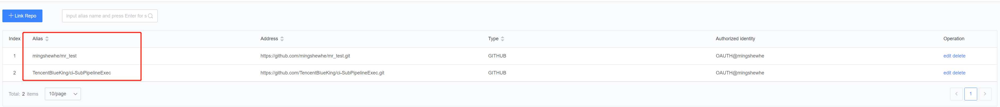
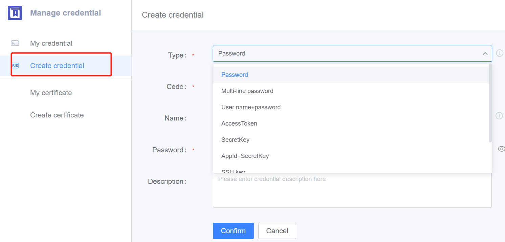

The checkout plugin provides basic git pull operations for the BK-CI platform, and can pull all git repositories.
## Plugin function
- Support pulling code based on the code base ID/alias imported into BK-CI.
- Support pulling code according to git warehouse url.
- Support pulling the specified branch/tag/commit.
- Support pulling files to the specified path.
- Support pulling submodule.
- Support pulling lfs files.
- Support shallow clone and partial clone.
- Support pre-merge: when the pr/mr event is triggered, the source branch and the target branch will be merged on the build machine.

## Instructions for use
### Parameter Input
#### Repository
- Select by repository: select a repository of type git from the BK-CI  code base list.
- Input by repository alias: BK-CI repository alias, support variables, BK-CI repository must be created first.
  
- Enter by repository URL: fill in the git repository URL, such as https://github.com/TencentBlueKing/ci-git-checkout.git

#### Authorization Type
The authorization type needs to be filled in only when [Repository] input parameter selects 'Enter by repository URL'
- Empty: The pulled repository does not require credentials, such as pulling the github open source repository.
- Credentials: You need to select [Repository Credentials], and you need to create a credential on the [Certificate Management] page first.
  
    1. If the git url is http/https type, you can create [username + password], [username password + private token], [AccessToken] type
    2. If the git url is ssh/git type, create [SSH private key], [SSH private key + private token] type
- access token: [access token] input box needs to fill in the value of access token
    1. The access token of github can be created on the https://github.com/settings/tokens page
    2. Gitlab can be created on the https://gitlab.com/-/profile/personal_access_tokens page, and private gitlab can be applied on the corresponding service page
- username/password: Enter the username and password in the [username] and [password] input boxes. This method is not recommended. If it is a username and password, it is recommended to save it in the credential management, and then use the credential reference

#### Specify the pull method
- BRANCH: Pull according to the branch, fill in the branch to be pulled in the [Branch/TAG/COMMIT] input box
- TAG: pull by tag, [branch/TAG/COMMIT] input box fill in the tag to be pulled
- COMMIT_ID: pull according to commitId, [branch/TAG/COMMIT] input box fills in the commitId to be pulled

#### Code storage path
Pull the code to the specified path
Notice:
1. It can only be pulled to the workspace. If the absolute path is filled in, it will also be pulled to the workspace. For example, if the workspace is /data/landun/workspace, and /tmp is filled in, then it will eventually be pulled to / data/landun/workspace/tmp directory.
2. If the same job pulls multiple code bases, you can avoid code coverage through this configuration.
#### Pull strategy
- Revert Update: increment, first "git reset --hard HEAD" each time, then "git pull"
- Fresh Checkout: full amount, each time will be a new clone code, before the entire workspace will be deleted
- Increment Update: increment, only use "git pull", does not clear conflicts and historical cache files
### Output parameters
After the plugin runs successfully, it will output the repository information pulled this time, which can be referenced in subsequent plugins through the context ${{jobs.xxx.steps.xxx.variable name}}

| Variable Name | Describe                                                                                                             |
| --- |----------------------------------------------------------------------------------------------------------------|
| BK_CI_GIT_REPO_URL | Repository url                                                                                                         |
| BK_CI_GIT_REPO_ALIAS_NAME | Repository alias                                                                                                          |
| BK_CI_GIT_REPO_NAME | Repository project name, if  the repository url is <br/>https://github.com/TencentBlueKing/ci-git-checkout.git, then the value is TencentBlueKing/ci-git-checkout |
| BK_CI_GIT_REPO_REF | Value of branch/TAG/COMMIT                                                                                               |
| BK_CI_GIT_REPO_CODE_PATH | The value of the code save path                                                                                                       | 
| BK_CI_GIT_REPO_LAST_COMMIT_ID        | When pulling the code, the last commit id of the last build                                                                                         |
| BK_CI_GIT_REPO_HEAD_COMMIT_ID        | When pulling the code, the last commit id of this build, the latest commitId on the build machine                                                                        |
| BK_CI_GIT_REPO_HEAD_COMMIT_COMMENT   | When pulling the code, the last commit comment of this build                                                                                          |
| BK_CI_GIT_REPO_HEAD_COMMIT_AUTHOR    | The new author generated this time                                                                                                  |
| BK_CI_GIT_REPO_HEAD_COMMIT_COMMITTER | The new committer generated this time                                                                                             |
| BK_CI_GIT_REPO_MR_TARGET_HEAD_COMMIT_ID | When pre merge, the target branch is the latestcommitId|
| BK_CI_GIT_REPO_MR_SOURCE_HEAD_COMMIT_ID | When pre merge, the latest commitId of the source branch|

## Scenes
The checkout plug-in can be used in conjunction with gitlab event triggering, github event triggering, and tgit event triggering. The premise of the cooperation is that the triggered repository is the same as the pulled repository url.
1. Push trigger, pull trigger branch
   [Branch/TAG/COMMIT] Fill in the value of the input box ${{BK_CI_REPO_GIT_WEBHOOK_BRANCH}}
2. Mr trigger, open perMerge
   The plugin enables pre-merge, which is enabled by default, and will automatically merge the source branch into the target branch
3. Mr trigger, only pull the source branch
   The plugin closes the per-merge function, and fills in the value of the [branch/TAG/COMMIT] input box${{BK_CI_REPO_GIT_WEBHOOK_SOURCE_BRANCH}}

## Using Restricted and Restricted Solutions
1. Git must have been installed on the build machine or mirror

## Common Failure Causes and Solutions
1. Use the ssh method to pull the code, and the Host key verification failed. fatal: Could not read from remote repository. error appears. If the public and private keys are correct, add them to ~/.ssh/config in the build machine.
```shell
# xxx is the domain name of the pulled repository
Host xxx
  StrictHostKeyChecking no
```
If it is in the mirror, and the mirror is inconvenient to modify, you can add the bash plugin before the plugin, enter
```shell
mkdir ~/.ssh
# xxx should be replaced with the domain name of the pulled repository
echo -e "Host xxx\nStrictHostKeyChecking no\n" > ~/.ssh/config
```
2. git common FAQ reference
   [Common errors and solutions for Git plugins](https://github.com/TencentBlueKing/ci-git-checkout/wiki/Git%E6%8F%92%E4%BB%B6%E5%B8%B8%E8%A7%81%E6%8A%A5%E9%94%99%E5%8F%8A%E8%A7%A3%E5%86%B3%E5%8A%9E%E6%B3%95)

## Install
[Add checkout plugin](./install.md)